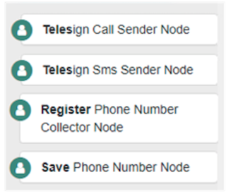
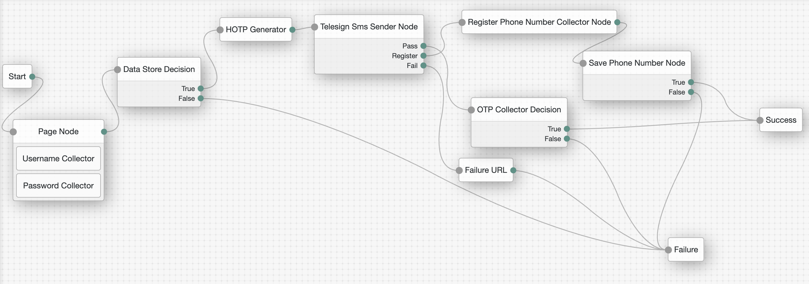
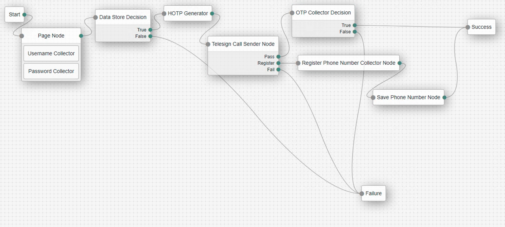

<!--
 * The contents of this file are subject to the terms of the Common Development and
 * Distribution License (the License). You may not use this file except in compliance with the
 * License.
 *
 * You can obtain a copy of the License at legal/CDDLv1.0.txt. See the License for the
 * specific language governing permission and limitations under the License.
 *
 * When distributing Covered Software, include this CDDL Header Notice in each file and include
 * the License file at legal/CDDLv1.0.txt. If applicable, add the following below the CDDL
 * Header, with the fields enclosed by brackets [] replaced by your own identifying
 * information: "Portions copyright [year] [name of copyright owner]".
 *
 * Copyright ${data.get('yyyy')} ForgeRock AS.
-->
# Telesign SMS/Call Auth Nodes
A simple authentication node for ForgeRock's Access Manager.

## Information

Telesign adds MFA to AM's authentication flow. This node bundle supports OTP SMS and Call
Only US phone numbers are supported on version 1.0.0. Multi country support will be added in future releases.
## Usage

Follow those steps to deploy these nodes:

1) Download telesign-node-1.0.jar and telesign-2.2.2.jar from the releases folder.
2) Copy telesign-node-1.0.jar into the tomcat/webapps/am/WEB-INF/lib directory where AM is deployed. 
3) Copy telesign-2.2.2.jar into the tomcat/lib directory
4) Restart tomcat to pick up the new nodes. The nodes will then appear in the authentication trees components palette.


Following are the nodes that will be available after deploying the jar file:




### Telesign Call Sender Node
This node will send a call to the phone number registered in the user's profile using Telesign's service. The following fields are required:
* **Phone Attribute Name** - Name of the attibute where the user's phone number is stored in the user store.
* **Telesign Customer ID** - Customer ID from Telesign.
* **Telesign API Key** - API Key from Telesign.

### Telesign SMS Sender Node
This node will send a SMS to the phone number registered in the user's profile using Telesign's service. The following fields are required:
* **Phone Attribute Name** - Name of the attibute where the user's phone number is stored in the user store.
* **Telesign Customer ID** - Customer ID from Telesign.
* **Telesign API Key** - API Key from Telesign.

### Register Phone Number Collector Node
This node will collect the phone number from the user if one is not found in the user store. The following fields are required:
* **Message** - Label message that will be displayed on top of the screen with the explanation of the page is to the user.
* **Prompt Message** - Message displayed in the textbox for the user to enter their phone number.


### Save Phone Number
This node will save the phone number to the user profile to use it in future authentication flows.


## Configuring Telesign SMS Auth Tree




```js
 Nodes To be Configured:
    * Telesign SMS Sende
    * Register Phone Number Collector
    * Save Phone Number
```

## Configuring Telesign Call Auth Tree




```js
 Nodes To be Configured:
    * Telesign Call Sende
    * Register Phone Number Collector
    * Save Phone Number
```


        


 


